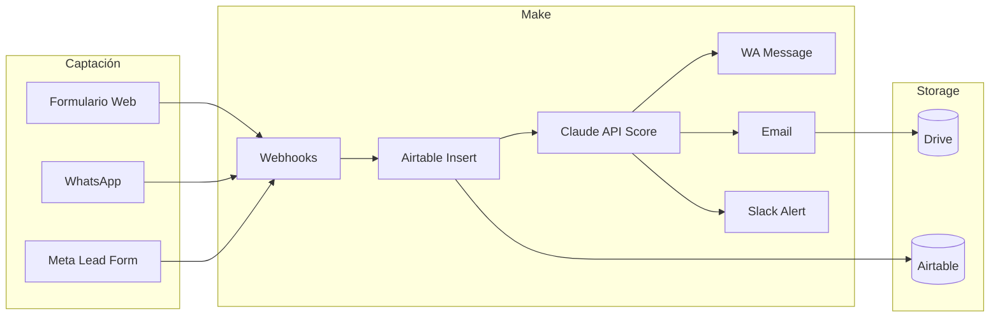

# CONEXIONES · MAKE
## Motor de automatización · todos los flows documentados

**Owner:** NEXUS-MAKE
**Plan recomendado:** Team ($29/mes · 40k ops) en Pro · Business ($99 · 100k+) en Premium
**Alternativa:** n8n self-hosted (Premium · cuando Make no alcanza)

---

## ESTRUCTURA DE ESCENARIOS

### Convención de nombres

```
[CATEGORIA]-[NUMERO]-[DESCRIPCION-CORTA]
```

Ejemplos:
- `LEADS-01-formulario-a-airtable`
- `LEADS-02-bienvenida-whatsapp`
- `VENTAS-01-recordatorio-propuesta-d3`
- `OPS-01-onboarding-cliente-h0`
- `REP-01-reporte-semanal-cliente`

---

## FLOWS CANÓNICOS DE ZENKAI INTERNO

### LEADS (captación + cualificación)

#### LEADS-01 · formulario-a-airtable
- **Trigger:** Webhook (URL: `/leads/new`)
- **Pasos:**
  1. Webhook recibe POST con datos del formulario
  2. Validar datos requeridos (nombre · email · mensaje)
  3. Crear registro en Airtable VENTAS / `leads`
  4. Trigger interno → LEADS-02
- **Ops por ejecución:** ~5
- **Ejecuciones esperadas/mes:** depende cliente

#### LEADS-02 · bienvenida-whatsapp
- **Trigger:** Airtable `leads` (nuevo registro)
- **Pasos:**
  1. Detectar horario laboral (módulo función)
  2. Si horario: enviar mensaje personalizado vía WA Cloud API
  3. Si fuera horario: enviar mensaje "fuera de horario"
  4. Actualizar Airtable: campo `fecha_primera_respuesta`
- **Ops por ejecución:** ~7
- **Manejo de error:** si WA falla, fallback a email + alerta a humano

#### LEADS-03 · email-bienvenida-cliente-final
Email automático al lead confirmando recibo.

#### LEADS-04 · email-interno-equipo
Email al equipo del cliente con datos del lead nuevo.

#### LEADS-05 · scoring-automatico
- **Trigger:** Airtable `leads` cuando `mensaje_original` se llena
- **Pasos:**
  1. Llamar API Anthropic Claude (Sonnet) con prompt de cualificación
  2. Recibir score 1-10 + razón
  3. Actualizar Airtable
  4. Si score ≥6: notificar humano vía Slack/WhatsApp
- **Ops por ejecución:** ~6
- **Costo extra:** tokens Claude (~$0.02 por scoring)

---

### VENTAS (pipeline)

#### VENTAS-01 · seguimiento-d3
- **Trigger:** Cron diario 10 AM
- **Pasos:**
  1. Filtrar Airtable `propuestas` con estado="enviada" y fecha_envio = hoy - 3 días
  2. Por cada uno: enviar mensaje WA personalizado + link
  3. Actualizar Airtable
- **Ops por ejecución:** ~10 por cada propuesta

#### VENTAS-02 · seguimiento-d7
Similar a D3 pero a D+7.

#### VENTAS-03 · seguimiento-d14
Similar a D14 (vence en 7 días).

#### VENTAS-04 · vencimiento-propuesta
Al vencer (D+21), actualizar a "vencida" + alerta a HERMES.

#### VENTAS-05 · contrato-a-firma
- **Trigger:** Airtable `propuestas` cambia a "aceptada"
- **Pasos:**
  1. Generar PDF de contrato (PandaDoc/Docuseal API)
  2. Enviar a firma
  3. Actualizar `contratos` con link al doc
  4. Notificar humano

#### VENTAS-06 · firma-completada
- **Trigger:** Webhook desde Docuseal/PandaDoc
- **Pasos:**
  1. Marcar contrato como firmado
  2. Generar link de pago
  3. Enviar al cliente
  4. Notificar ATLAS para preparar onboarding

#### VENTAS-07 · pago-confirmado
- **Trigger:** Webhook desde Stripe/Wompi
- **Pasos:**
  1. Marcar `factura` como pagada
  2. Trigger OPS-01 (onboarding)
  3. Notificar humano

---

### OPS (operaciones)

#### OPS-01 · onboarding-cliente-h0
Ejecuta los pasos H+0 del workflow-onboarding.md.

#### OPS-02 · agendar-kickoff
Generar link Cal.com personalizado · enviar al cliente.

#### OPS-03 · enviar-brief-detallado
Typeform/JotForm con preguntas adaptadas al sector.

#### OPS-04 · alerta-tarea-vencida
Cron diario · revisa Airtable `tareas` con deadline pasada · alerta a owner.

#### OPS-05 · status-semanal-cliente
Cron lunes 9 AM · genera reporte personalizado por cliente.

---

### REPORTES

#### REP-01 · reporte-semanal-cliente
- **Trigger:** Cron lunes 7 AM
- **Pasos:**
  1. Por cliente activo en Airtable
  2. Agregar datos de Meta Ads · Google Ads · Klaviyo · Airtable
  3. Llamar a Claude con prompt de redacción
  4. Generar PDF (custom o PandaDoc API)
  5. Subir a Drive
  6. Enviar email + WA + actualizar Notion
- **Ops por ejecución:** ~30 por cliente
- **Costo extra:** ~$0.06 tokens Claude por reporte

#### REP-02 · reporte-interno-zenkai
Cron lunes 9 AM · genera reporte consolidado para Perfil 1 + 2.

---

### SOPORTE

#### SOP-01 · ticket-nuevo-airtable
Webhook desde formulario soporte / WhatsApp → ticket en Airtable.

#### SOP-02 · escalada-ticket-no-resuelto
Alerta si ticket P0/P1 no resuelto en SLA.

#### SOP-03 · nps-post-onboarding
Cron · 5 días después de kickoff · enviar encuesta NPS.

---

## FLOWS POR CLIENTE (CAPA 2)

Cada cliente activo tiene su propio set de escenarios Make. Documentados en `clientes/[slug]/automatizaciones/`.

Patrones típicos:

### E-commerce
- Pedido nuevo Shopify → Airtable + Klaviyo segmentación
- Carrito abandonado → flow de 3 emails
- Pixel/CAPI server-side
- Reseña post-compra → Loox/Judge.me + email automático

### Salud
- Cita agendada Cal.com → Airtable + WA confirmación
- Recordatorio D-1 y D-3h
- Post-consulta → encuesta NPS + recomendación

### Restaurantes
- Pedido WA → Airtable + cocina/POS
- Reseña Google nueva → alerta + plantilla respuesta

---

## REGLAS DE OPERACIÓN

### Costo
- Optimizar para minimizar ops (usar routers + iterators · evitar webhooks innecesarios)
- Monitorear consumo cada lunes (NEXUS-MONITOR)
- Alertas si superas 80% del límite del plan

### Seguridad
- API keys nunca hardcoded (usar Make Connections)
- Rotación de keys trimestral
- Webhook URLs con tokens secretos (`/webhook/[uuid]`)
- Rate limiting en webhooks expuestos

### Manejo de errores
- Cada escenario debe tener Error Handler
- Alertas a Slack si error rate >2%
- Logs persistentes en Airtable tabla `make_logs`

### Versionado
- Cambios mayores: nuevo escenario, no editar el productivo
- Mantener escenarios obsoletos por 30 días en "paused" antes de eliminar
- Naming versioning: `[CAT]-XX-v2-...`

---

## ALTERNATIVA: n8n SELF-HOSTED

Cuándo migrar a n8n:
- Make Business ($99) no alcanza por volumen
- Cliente Premium con requisitos de privacidad (datos no salen del cliente)
- Compliance específico

n8n stack típico:
- Servidor: Hetzner / DigitalOcean / AWS EC2
- DB: Postgres
- Hosting: Docker + nginx + SSL
- Monitoreo: BetterStack
- Costo: $50-200/mes según escala

---

## DIAGRAMA DE FLUJO TÍPICO



---

## ENTRENAMIENTO PARA EL EQUIPO

Cada miembro de ZENKAI o freelancer recurrente debe saber:
- Cómo ver logs de un escenario
- Cómo pausar/reanudar un escenario
- Cómo crear un escenario nuevo desde un template
- Cómo manejar Error Handlers
- Cuándo NO modificar (escenarios productivos críticos)

Capacitación de 2h al onboarding · documentación viva en Notion ZENKAI.
