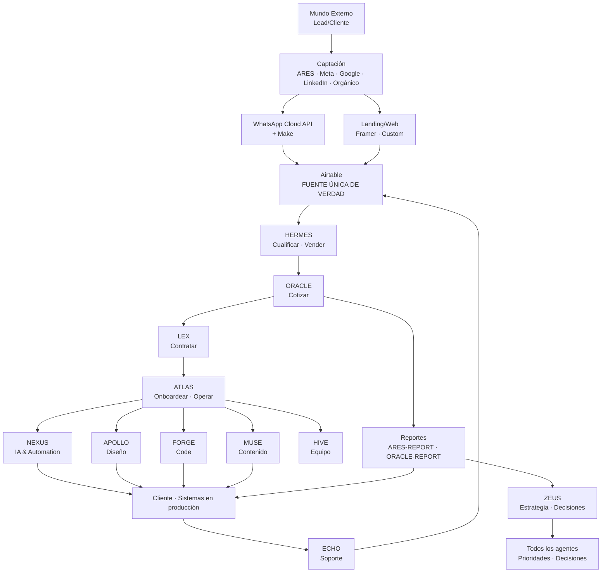

# MAPA DEL SISTEMA · ZENKAI
## Cómo se conectan los 12 departamentos · Capa 1

> Este es el plano de cómo todo se conecta. Si algo no está aquí, o no existe o no es parte del sistema "oficial".

---

## ARQUITECTURA EN ALTO NIVEL



---

## FUENTES DE VERDAD

| Tipo de dato | Fuente única | Quién la mantiene |
|--------------|--------------|-------------------|
| Leads · Clientes · Pipeline | **Airtable** | HERMES · ATLAS |
| Documentación de proyectos · SOPs | **Notion** | ATLAS · cada agente |
| Código · automatizaciones | **GitHub** + Make/n8n | NEXUS · FORGE |
| Assets de cliente | **Google Drive** | ATLAS · APOLLO |
| Conversaciones con cliente | **WhatsApp Cloud API logs** + Airtable | HERMES · ECHO |
| Métricas y reportes | **Airtable + Looker Studio** | ORACLE · ARES |
| Identidad visual ZENKAI | **Figma + Notion** | APOLLO |

---

## CAPAS DEL SISTEMA

### CAPA 1 · Plataforma interna (lo que estás viendo aquí)
- Los 12 agentes
- Los 11 sectores
- Skills · workflows · templates · SOPs
- Configuraciones de Make / Airtable / Notion

**Esta capa NO se vende. Es el medio.**

### CAPA 2 · Servicios al cliente (lo que se vende)
- Landing page del cliente
- Sistemas de IA construidos para el cliente
- Reportes
- Soporte
- Etc.

**Esta capa SÍ se vende. Es el producto.**

---

## INTEGRACIONES PRINCIPALES (CAPA 1)

### LLM Providers
- **Anthropic Claude** (Sonnet · Opus · Haiku) — agentes principales
- **Google Gemini** — multimodal
- API keys gestionadas por NEXUS · variables de entorno

### Automation
- **Make** — motor primary
- **n8n** (self-hosted) — Premium o cuando Make no alcanza
- Webhooks bidireccionales con todo lo demás

### Database
- **Airtable** — fuente de verdad
- **Postgres / Supabase** — cuando Airtable no escala (FORGE backend)
- **Vector DB (Pinecone)** — solo en Premium con búsqueda semántica

### Comunicación
- **WhatsApp Cloud API** — canal primario clientes hispanohablantes
- **Resend / SendGrid** — email transaccional
- **Slack** — comunicación interna ZENKAI (Pro+)

### Frontend / Web
- **Framer** — landings y sites (Pro)
- **Vercel + Next.js** — apps custom (Premium o cuando Framer no alcanza)
- **Cloudflare** — DNS · CDN · SSL

### Pagos
- **Stripe** — internacional
- **Wompi · MercadoPago** — Colombia / LATAM
- **Wave / Siigo / Alegra** — facturación electrónica

### Firma & Documentos
- **Docuseal · PandaDoc** — firma electrónica
- **Google Drive** — documentos finales
- **Notion** — vivos · workflows

### Monitoreo
- **Sentry · BetterStack · UptimeRobot** — uptime + errores
- **Custom Airtable views** — dashboards internos
- **Looker Studio** — reportes públicos a clientes

---

## FLUJO DE DATOS · LEAD A CLIENTE A REPORTE

```
1. Lead llena formulario en landing del cliente
   ↓
2. Webhook → Make → registro en Airtable `leads`
   ↓
3. Make trigger → WhatsApp Cloud API mensaje al lead (<30s)
                → Email interno al equipo del cliente
                → Email automático al lead
   ↓
4. HERMES-WA + HERMES-QUALIFY procesan en Airtable
   ↓
5. Si score ≥6: humano cierra (workflow-nuevo-cliente.md)
   ↓
6. LEX-CONTRACT + ORACLE → Stripe → ATLAS-ONBOARD
   ↓
7. ATLAS crea clientes/[slug]/ + Notion + Drive del cliente
   ↓
8. NEXUS · APOLLO · FORGE construyen
   ↓
9. ATLAS-QA aprueba · sistema en producción
   ↓
10. NEXUS-MONITOR mantiene · ECHO atiende soporte
    ↓
11. Cron lunes 9 AM → ARES-REPORT genera reporte semanal
    → email + WhatsApp + Notion del cliente
    ↓
12. ORACLE consolida revenue · costos · margen → ZEUS
    ↓
13. ZEUS revisa · decide · prioriza próxima semana
```

---

## DEPENDENCIAS CRÍTICAS

| Dependencia | Si falla, qué se rompe | Plan B |
|-------------|------------------------|--------|
| Anthropic API | Todos los agentes | Gemini fallback (no equivalente, pero opera) |
| Airtable | Fuente única de verdad | Backup CSV diario · plan recovery |
| Make | Automatizaciones | n8n self-hosted como respaldo |
| WhatsApp Cloud API | Comunicación primaria con leads | Email + Telegram como respaldo |
| Stripe / Wompi | Cobros | Transferencia bancaria manual |

---

## ARCHIVOS DE CONFIGURACIÓN POR CONEXIÓN

- [`conexiones-make.md`](conexiones-make.md) — flows Make documentados
- [`conexiones-airtable.md`](conexiones-airtable.md) — bases · tablas · views
- [`conexiones-whatsapp.md`](conexiones-whatsapp.md) — Cloud API · BSP · templates HSM
- [`conexiones-framer.md`](conexiones-framer.md) — sites · componentes · templates

---

## REGLAS DEL MAPA

1. **Si está aquí, existe.** Si no está, no es oficial · no se mantiene · no se considera parte del sistema.
2. **Cualquier cambio estructural** (nueva integración · cambio de fuente de verdad · cambio de motor) → escalada a ZEUS antes.
3. **Documentar antes de construir.** No "lo construyo y luego documento". Plan primero, build después.
4. **Versionar.** Este archivo se actualiza cada vez que cambia la arquitectura. Cambios en commit con mensaje descriptivo.
